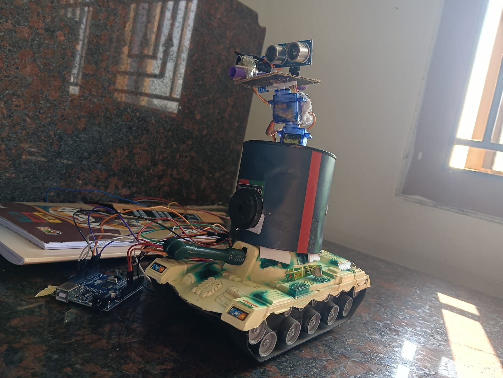

# Arduino Robotic Obstacle Detection

An academic team project built using Arduino, ultrasonic sensing, and servo motor control. The system uses an ultrasonic sensor to detect objects within a defined distance and controls servo motors as part of the robotic scanning mechanism.

## Project Overview

The project demonstrates the integration of:

- Arduino-based control
- Ultrasonic distance sensing
- Servo motor control
- Embedded C/C++ programming
- Basic robotic scanning and obstacle detection

The ultrasonic sensor continuously measures the distance of objects in front of the robot. Based on the detected distance, the servo-controlled mechanism changes its position.

## Key Features

- Ultrasonic-based distance measurement
- Servo-controlled robotic mechanism
- Automatic scanning movement
- Serial Monitor output for measured distance
- Arduino-based embedded control

## Hardware Components

- Arduino board
- Ultrasonic sensor
- Servo motors
- Robotic tank chassis
- Jumper wires
- Breadboard / connecting hardware
- Power supply

## Software & Technologies

- Arduino
- Embedded C/C++
- Arduino Servo Library
- Ultrasonic distance sensing
- Serial communication

## Working Principle

1. The Arduino initializes the servo motors and ultrasonic sensor.
2. The servo-controlled mechanism performs a scanning movement.
3. The ultrasonic sensor sends a signal and receives the reflected echo.
4. The Arduino calculates the approximate distance of the detected object.
5. If an object is detected within the defined distance threshold, the servo mechanism changes its position.
6. The measured distance is also displayed through the Serial Monitor.

## Project Image



## Source Code

The Arduino source code is available in:

`src/robot.ino`

## My Contribution

As a team member, my contribution included:

- Hardware setup and component integration
- Assistance with Arduino coding and testing
- Assistance with project presentation
- Supporting the integration and demonstration of the robotic system

## Project Type

**Academic Team Project**

## Repository Structure

```text
arduino-robotic-obstacle-detection/
│
├── README.md
│
├── images/
│   └── robot.jpeg
│
└── src/
    └── robot.ino
